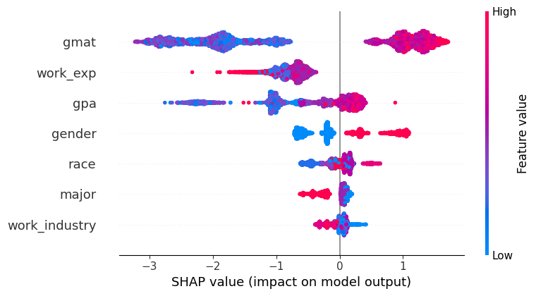
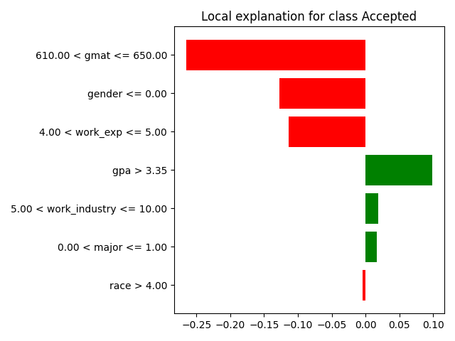
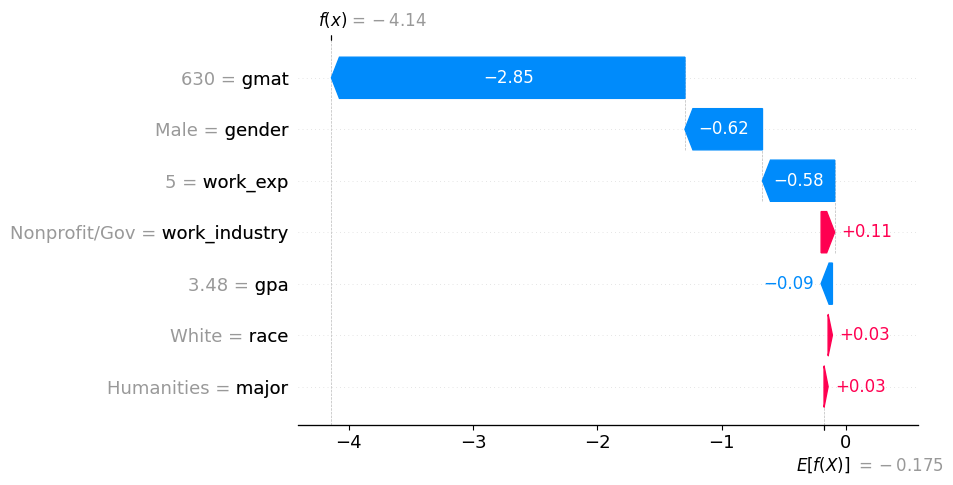
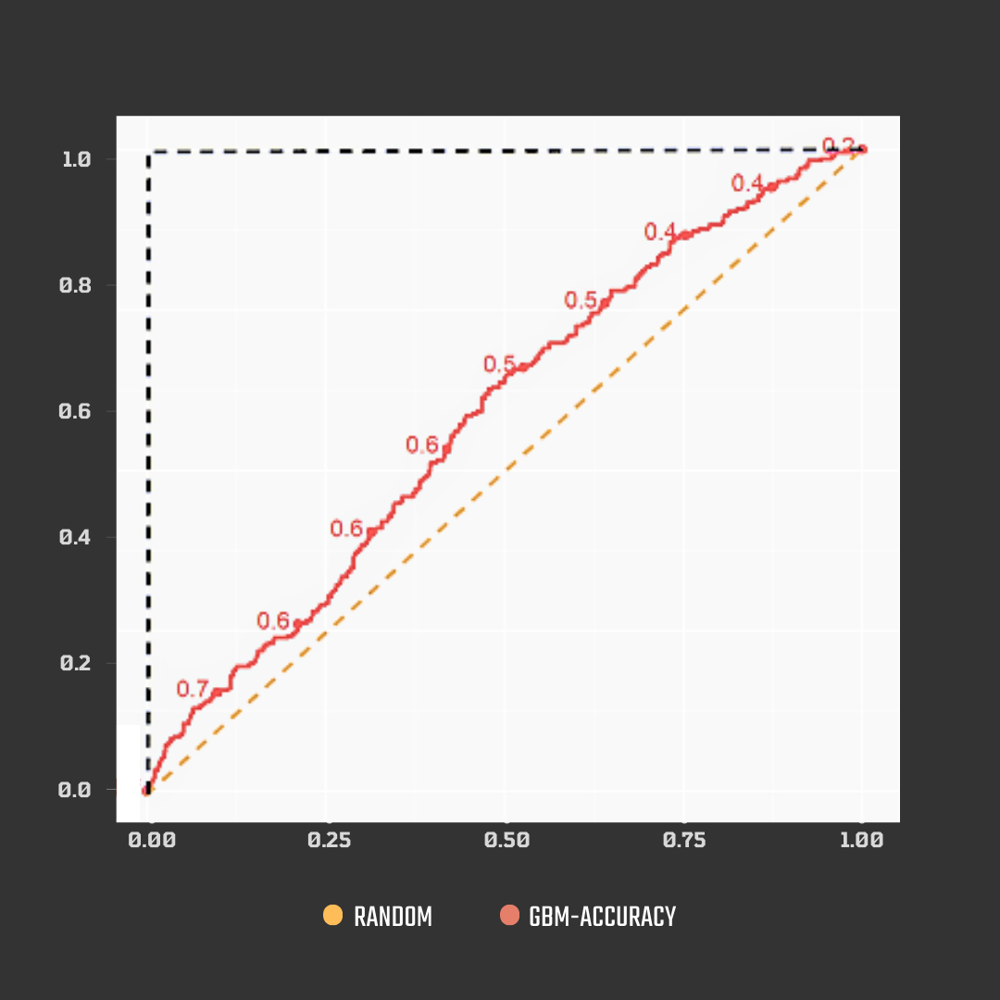

# AI and Society

> Coursework for the *AI and Society* MSc course (FEUP & FCUP): a flagship
> responsible-AI case study on algorithmic fairness and explainability, plus four
> hands-on data-centric AI workshops.

[](https://www.python.org/)
[](https://jupyter.org/)
[](https://scikit-learn.org/)
[](https://github.com/shap/shap)
[](https://ias-rotterdam.netlify.app/)
[](case_study/report.pdf)

This repository collects the work produced for the *AI and Society* MSc course at
FEUP and FCUP. It has two parts:

1. **[`case_study/`](case_study/)** - *Inside the Suspicious Machine*, a group
   fairness-and-explainability audit inspired by the Rotterdam welfare-fraud
   "suspicion machine".
2. **[`workshops/`](workshops/)** - four hands-on tutorials covering the
   data-centric AI techniques that underpin responsible machine learning.

---

## Table of Contents

- [Case Study: Inside the Suspicious Machine](#case-study-inside-the-suspicious-machine)
  - [Overview](#overview)
  - [Dataset](#dataset)
  - [Methodology](#methodology)
  - [Results and Key Findings](#results-and-key-findings)
  - [Presentation and Report](#presentation-and-report)
- [Workshops](#workshops)
  - [T01 - Data-Centric AI and Data Profiling](#t01---data-centric-ai-and-data-profiling)
  - [T02 - Data Complexity and Meta-Learning](#t02---data-complexity-and-meta-learning)
  - [T03 - Imbalanced Data](#t03---imbalanced-data)
  - [T04 - Missing Data](#t04---missing-data)
- [Repository Structure](#repository-structure)
- [Getting Started](#getting-started)
- [Team and Attribution](#team-and-attribution)

---

## Case Study: Inside the Suspicious Machine

> An algorithmic-fairness and explainability audit of a high-stakes, automated
> decision system, inspired by the Rotterdam welfare-fraud "suspicion machine".

A responsible-AI study that reproduces, on a public proxy dataset, the kind of
fairness and explainability failures that led a real-world government algorithm to be
shut down, and demonstrates the modern toolkit auditors can use to make such failures
visible. Full details live in [`case_study/`](case_study/).

### Overview

In 2020, the city of Rotterdam halted a machine-learning system that scored welfare
recipients for the likelihood of fraud. The gradient-boosting model, built by
Accenture, was abandoned after an ethical and legal review concluded that it
discriminated against people through proxies for ethnicity and gender, while
performing only marginally better than random selection. The case became a landmark
example of how an opaque, "objective" algorithm can encode and scale social bias in a
punitive, high-stakes setting.

This project asks a practical question: **if we were auditing a model like
Rotterdam's, how would we detect that it is unfair, and how would we explain its
decisions?** Because the original Rotterdam data was never made public, we recreate
the conditions of the problem on a comparable decision task and apply a full
fairness-and-explainability pipeline to it. The goal is not to ship a model, but to
show that bias which is invisible in an accuracy score becomes clearly visible once
the right diagnostic tools are applied, consistent with the EU guidelines for
Trustworthy AI.

### Dataset

The audit uses the **MBA Admission Dataset (Class of 2025)**, published on Kaggle, as
a proxy for the Rotterdam system. It is included in the repository as
[`case_study/MBA.csv`](case_study/MBA.csv).

It was chosen because it mirrors the structural properties of the original problem:

- A **binary, high-stakes decision** (admit or deny) that materially affects a
  person's future.
- **Sensitive attributes** such as gender and race are present alongside legitimate
  features, exactly the setting in which proxy discrimination arises.
- A **class imbalance** between admitted and non-admitted applicants, mirroring the
  rare-positive nature of fraud detection.

Unlike the punitive Rotterdam system, MBA admission is not a benefit-denial
mechanism, but it shares the same fairness and explainability concerns, which makes
it a defensible stand-in for demonstrating the methodology.

### Methodology

The analysis lives in [`case_study/Notebook.ipynb`](case_study/Notebook.ipynb) and
follows the pipeline below.

| Stage | Approach |
|---|---|
| **Model** | A **Gradient Boosting Machine** (`GradientBoostingClassifier`), the same model family used by the Rotterdam system. |
| **Class imbalance** | **Borderline-SMOTE** to synthesise minority-class examples near the decision boundary. |
| **Evaluation** | Standard `classification_report` (precision, recall, F1 per class). |
| **Global explainability** | **SHAP** summary and dependence plots, and **Permutation Feature Importance**. |
| **Local explainability** | **SHAP** waterfall plots and **LIME** explanations for individual applicants. |
| **Fairness** | **Counterfactual fairness** experiments that flip sensitive attributes (race, gender) and measure how the prediction changes. |

### Results and Key Findings

The model reaches an overall accuracy of **0.78**, but that headline figure hides a
sharp asymmetry between the two classes.

| Class | Precision | Recall | F1-score | Support |
|---|---|---|---|---|
| Not admitted (0) | 0.92 | 0.81 | 0.86 | 1043 |
| Admitted (1) | 0.38 | 0.61 | 0.47 | 196 |
| **Accuracy** | | | **0.78** | 1239 |
| Macro avg | 0.65 | 0.71 | 0.67 | 1239 |
| Weighted avg | 0.83 | 0.78 | 0.80 | 1239 |

The model is strong on the majority "not admitted" class but weak on the minority
"admitted" class (F1 of just 0.47), the same pattern of an apparently good model that
is unreliable precisely where the decision matters most.

The explainability and counterfactual analyses reveal the bias directly:

- About **39%** of misclassified Black applicants would have been **accepted** had
  they been labelled White.
- About **33%** of accepted White applicants would have been **rejected** had they
  been labelled Black.
- A **gender bias favouring men** is observed within the Asian group.

These results show that sensitive attributes leak into the decision, and that SHAP,
LIME, and counterfactual fairness expose this in a way a single accuracy metric never
could.

#### SHAP global feature importance



*Global SHAP values rank each feature by its overall impact on the model's
predictions, surfacing how strongly sensitive attributes drive the outcome.*

#### LIME local explanation



*A LIME explanation for an individual applicant, decomposing a single decision into
the features that pushed it toward admission or rejection.*

#### SHAP local explanation (waterfall)



*A SHAP waterfall plot traces, contribution by contribution, how the model arrived at
the score for one applicant.*

#### Model performance



*Performance overview of the Gradient Boosting Machine after Borderline-SMOTE
resampling.*

### Presentation and Report

- **Live presentation website:** https://ias-rotterdam.netlify.app/
- **Full report:** [`case_study/report.pdf`](case_study/report.pdf)

The presentation can also be viewed locally by opening
[`case_study/presentation/index.html`](case_study/presentation/index.html) in a
browser.

---

## Workshops

Four hands-on tutorials completed during the course, each exploring a core
data-centric AI theme. Every workshop folder contains its own `README.md`, the
tutorial notebook, the dataset, and the workshop slides/report. A consolidated,
unpinned dependency list is in [`workshops/requirements.txt`](workshops/requirements.txt).

### T01 - Data-Centric AI and Data Profiling

- **Topic:** Data profiling as the foundation of the *Data-Centric AI* paradigm.
- **Dataset:** MBA Admission Dataset.
- **Techniques and tools:** Manual profiling with `pandas`, subgroup analysis by race
  and gender, and automated reporting with **`ydata-profiling`**.
- **Key takeaway:** Profiling exposes data-quality issues and demographic imbalances
  early, motivating the fairness concerns of the case study.
- **Links:** [notebook](workshops/T01_Data_Profiling/technical_tutorial/ias01_202108735.ipynb)
  - [slides (PDF)](workshops/T01_Data_Profiling/ias_ia01.pdf)
  - [README](workshops/T01_Data_Profiling/README.md)

### T02 - Data Complexity and Meta-Learning

- **Topic:** Measuring problem difficulty at the dataset and instance level, and how a
  single feature drives it.
- **Dataset:** Obesity Levels Dataset.
- **Techniques and tools:** Dataset-level complexity with **`problexity`**,
  meta-features with **`pymfe`**, and Instance Hardness / Instance Space Analysis with
  **`pyhard`**; complexity recomputed with and without the dominant `BMI` feature.
- **Key takeaway:** The data is easy largely because BMI cleanly separates the
  classes; removing it raises measured complexity, showing how one feature can
  dominate difficulty.
- **Links:** [notebook](workshops/T02_Data_Complexity_MtL/technical_tutorial/tutorial.ipynb)
  - [slides (PDF)](workshops/T02_Data_Complexity_MtL/Data_Complexity_Meta_learning.pdf)
  - [README](workshops/T02_Data_Complexity_MtL/README.md)

### T03 - Imbalanced Data

- **Topic:** Handling class imbalance in a multiclass medical classification task.
- **Dataset:** Fetal Health Dataset (cardiotocography; Normal / Suspect / Pathological).
- **Techniques and tools:** **`imbalanced-learn`** resampling, comparing
  `RandomOverSampler`, `RandomUnderSampler`, `SMOTE`, `BorderlineSMOTE`, `ADASYN`,
  `SMOTEENN`, and `SMOTETomek` across multiple classifiers.
- **Key takeaway:** Resampling improves minority-class recall; in these runs
  `RandomOverSampler` performed best and the hybrid `SMOTEENN` worst, so more complex
  methods are not always better.
- **Links:** [notebook](workshops/T03_Imbalanced_Data/technical_tutorial/tutorial.ipynb)
  - [slides (PDF)](workshops/T03_Imbalanced_Data/IA03_Imbalanced_Data.pdf)
  - [README](workshops/T03_Imbalanced_Data/README.md)

### T04 - Missing Data

- **Topic:** Missing-data mechanisms (MCAR, MAR, MNAR) and how imputation choice
  affects model performance.
- **Dataset:** Heart Disease Dataset.
- **Techniques and tools:** Missingness simulated with **`mdatagen`**; imputation
  compared across scikit-learn's `SimpleImputer` (mean), `KNNImputer`, and
  `IterativeImputer` (MICE), evaluated against a no-missing baseline.
- **Key takeaway:** The best imputer depends on the mechanism: mean imputation wins
  for MCAR, while mechanism-aware imputers (KNN, MICE) win for MAR.
- **Links:** [notebook](workshops/T04_Missing_Data/code/tutorial.ipynb)
  - [report (PDF)](workshops/T04_Missing_Data/report-202108735.pdf)
  - [README](workshops/T04_Missing_Data/README.md)

---

## Repository Structure

```
AI-Society/
├── README.md
├── .gitignore
├── case_study/                       # Flagship fairness and explainability audit
│   ├── Notebook.ipynb                # End-to-end analysis (model, SHAP, LIME, fairness)
│   ├── MBA.csv                       # MBA Admission Dataset (proxy for Rotterdam)
│   ├── report.pdf                    # Full ACM-style paper, "Inside the Suspicious Machine"
│   ├── requirements.txt              # Python dependencies for the case study
│   └── presentation/                 # Slide deck (HTML / CSS / JS) and result plots
│       ├── index.html
│       ├── script.js
│       ├── styles.css
│       └── images/                   # SHAP / LIME / performance figures
└── workshops/                        # Four hands-on course tutorials
    ├── requirements.txt              # Consolidated dependencies for all workshops
    ├── T01_Data_Profiling/
    │   ├── README.md
    │   ├── ias_ia01.pdf
    │   └── technical_tutorial/
    │       ├── ias01_202108735.ipynb
    │       └── MBA.csv
    ├── T02_Data_Complexity_MtL/
    │   ├── README.md
    │   ├── Data_Complexity_Meta_learning.pdf
    │   └── technical_tutorial/
    │       ├── tutorial.ipynb
    │       ├── obesity.csv
    │       ├── complexity_with_bmi.png
    │       ├── complexity_without_bmi.png
    │       ├── mfe_with_bmi.txt
    │       ├── mfe_without_bmi.txt
    │       └── instance_space_analysis/   # PyHard Instance Space Analysis outputs
    ├── T03_Imbalanced_Data/
    │   ├── README.md
    │   ├── IA03_Imbalanced_Data.pdf
    │   └── technical_tutorial/
    │       ├── tutorial.ipynb
    │       └── fetal_health.csv
    └── T04_Missing_Data/
        ├── README.md
        ├── report-202108735.pdf
        ├── code/
        │   ├── tutorial.ipynb
        │   └── heart.csv
        └── figures/                  # MCAR / MAR / MNAR performance plots
```

## Getting Started

### Case study

The audit is a self-contained Jupyter notebook.

```bash
# From the repository root
cd case_study

# (Recommended) create and activate a virtual environment
python -m venv .venv
# Windows:        .venv\Scripts\activate
# macOS / Linux:  source .venv/bin/activate

# Install dependencies (Python 3.10+)
pip install -r requirements.txt

# Launch the notebook
jupyter notebook Notebook.ipynb
```

Run the cells top to bottom to reproduce the model, the evaluation, the SHAP and LIME
explanations, and the counterfactual-fairness experiments.

### Workshops

Each workshop notebook is self-contained next to its dataset. The workshops use extra
libraries (`ydata-profiling`, `problexity`, `pymfe`, `pyhard`, `imbalanced-learn`,
`mdatagen`) listed in [`workshops/requirements.txt`](workshops/requirements.txt):

```bash
pip install -r workshops/requirements.txt
```

Then open any workshop notebook, for example:

```bash
jupyter notebook workshops/T03_Imbalanced_Data/technical_tutorial/tutorial.ipynb
```

Note: `pyhard` (T02) is sensitive to its environment and is most reliably installed in
a dedicated Python 3.9 environment, as described in that notebook.

## Team and Attribution

The flagship case study was developed as a group assignment for the *AI and Society*
MSc course at FEUP and FCUP. The workshops were completed as individual coursework.

- Ana Azevedo
- Diogo Silva
- Félix Martins
- Francisco Campos
- João Figueiredo
